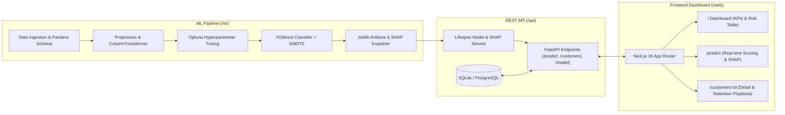

# ChurnSight — Customer Churn Prediction Platform

An end-to-end, production-grade Customer Churn Prediction & Retention Intelligence platform. Powered by an automated machine learning pipeline (**XGBoost**, **SMOTE**, **Optuna**, **SHAP**), a high-performance **FastAPI** REST backend, and a modern **Next.js 16** (App Router, TypeScript, TanStack Table, Recharts) dashboard.

---

## 🏛️ System Architecture



---

## 📊 Model Evaluation & Benchmarks

The XGBoost model is tuned using Bayesian optimization (**Optuna** TPE sampler) over stratified cross-validation folds on balanced training data (SMOTE):

| Metric | Measured Value | Description |
| :--- | :--- | :--- |
| **ROC-AUC** | **0.7150** | Area under Receiver Operating Characteristic curve |
| **Recall (Churn Class)** | **95.86%** | Captured 417 out of 435 actual churners on held-out test set |
| **Average Precision (PR-AUC)** | **0.6555** | Precision-Recall curve area |
| **F1 Score** | **0.6238** | Harmonic mean of precision and recall |
| **Test Set Size** | **1,000 samples** | 20% stratified holdout partition |

### Top Churn Risk Drivers (SHAP TreeExplainer)
1. **Contract Type (Month-to-month)** — Strongest churn risk multiplier
2. **Support Tickets (Last 30 Days)** — Friction indicator; tickets ≥ 3 spike churn probability
3. **Tenure Months** — Protective factor as tenure increases
4. **Monthly Charges** — Higher charges moderately increase churn risk
5. **Payment Method (Electronic Check)** — Higher churn compared to automated ACH or credit card

---

## 📁 Repository Structure

```
churn-predictor/
├── ml/                         # ML Pipeline
│   ├── data/raw/               # Raw customer dataset (synthetic / IBM Telco)
│   ├── models/                 # Serialized artifacts (churn_pipeline.joblib, metrics.json, SHAP plots)
│   ├── src/
│   │   ├── preprocess.py       # Pandera validation & scikit-learn transformers
│   │   ├── train.py            # Optuna tuning, SMOTE, MLflow tracking, XGBoost
│   │   ├── evaluate.py         # Full metrics computation & JSON export
│   │   └── explain.py          # TreeSHAP summary plot & feature importance
│   └── tests/                  # Unit tests for preprocessing & model integrity
│
├── api/                        # FastAPI Service
│   ├── app/
│   │   ├── main.py             # FastAPI entrypoint, CORS, lifespan hooks
│   │   ├── schemas.py          # Pydantic v2 validation models
│   │   ├── routers/            # /health, /model, /predict, /customers
│   │   └── services/           # ModelService, DbService, ShapService
│   ├── tests/                  # Pytest + HTTPX async test suite (20 tests)
│   ├── requirements.txt
│   └── Dockerfile              # Multi-stage production container
│
├── web/                        # Next.js 16 Dashboard
│   ├── app/
│   │   ├── page.tsx            # Main executive dashboard
│   │   ├── predict/page.tsx    # Live inference playground with presets & SHAP
│   │   ├── customers/[id]/     # Customer deep-dive & retention playbook
│   │   ├── layout.tsx          # Root layout with sidebar navigation
│   │   └── globals.css         # Glassmorphism design tokens & styles
│   └── lib/                    # Typed API client, schemas, utilities
│
├── .github/workflows/          # CI/CD pipelines
│   ├── ci.yml                  # Ruff lint, Pytest (ML & API), Next.js build
│   └── deploy.yml              # Cloud Run container build & Firebase deploy
├── firebase.json               # Firebase App Hosting config
└── apphosting.yaml             # Cloud Run & App Hosting environment specs
```

---

## 🚀 Quickstart & Local Development

### 1. Prerequisites
- Python 3.11+
- Node.js 20+

### 2. ML Pipeline Setup & Retraining
```bash
# Navigate to repository root
cd churn-predictor

# Install ML dependencies
pip install -r api/requirements.txt

# Run preprocessing & model training
python ml/src/train.py --trials 25

# Evaluate test set metrics
python ml/src/evaluate.py

# Generate SHAP explainability assets
python ml/src/explain.py

# Run ML unit tests
pytest ml/tests/ -v
```

### 3. Running the REST API
```bash
cd churn-predictor/api

# Run with hot reload
uvicorn app.main:app --host 127.0.0.1 --port 8000 --reload
```
API Documentation will be live at:
- Swagger UI: `http://localhost:8000/docs`
- ReDoc: `http://localhost:8000/redoc`

Run API tests:
```bash
pytest tests/ -v
```

### 4. Running the Next.js Frontend
```bash
cd churn-predictor/web

# Install npm packages
npm install

# Start development server
npm run dev
```
Open `http://localhost:3000` to view the dashboard.

---

## 📡 REST API Reference

### Health Check
`GET /health`
```json
{
  "status": "ok",
  "version": "1.0.0"
}
```

### Single Customer Prediction
`POST /predict`

**Request Body:**
```json
{
  "tenure_months": 3,
  "monthly_charges": 89.5,
  "total_charges": 268.5,
  "contract_type": "month-to-month",
  "payment_method": "electronic_check",
  "support_tickets_30d": 4
}
```

**Response (`HTTP 200 OK`):**
```json
{
  "customer_id": null,
  "churn_probability": 0.8421,
  "risk_tier": "high",
  "top_factors": [
    {
      "feature": "contract_type_month-to-month",
      "value": 1.0,
      "shap_impact": 0.5213,
      "direction": "increases_churn"
    },
    {
      "feature": "support_tickets_30d",
      "value": 4.0,
      "shap_impact": 0.3812,
      "direction": "increases_churn"
    },
    {
      "feature": "tenure_months",
      "value": 3.0,
      "shap_impact": 0.2941,
      "direction": "increases_churn"
    }
  ]
}
```

**Validation Error Example (`HTTP 422 Unprocessable Entity`):**
```bash
curl -X POST http://localhost:8000/predict -H "Content-Type: application/json" -d '{}'
```
```json
{
  "detail": [
    { "loc": ["body", "tenure_months"], "msg": "Field required", "type": "missing" },
    { "loc": ["body", "monthly_charges"], "msg": "Field required", "type": "missing" },
    { "loc": ["body", "total_charges"], "msg": "Field required", "type": "missing" },
    { "loc": ["body", "contract_type"], "msg": "Field required", "type": "missing" },
    { "loc": ["body", "payment_method"], "msg": "Field required", "type": "missing" },
    { "loc": ["body", "support_tickets_30d"], "msg": "Field required", "type": "missing" }
  ]
}
```

### Batch Prediction
`POST /predict/batch`
- Accepts multipart `file` (`.csv`)
- Returns scored CSV stream with `churn_probability`, `risk_tier`, and top drivers.

### At-Risk Customers
`GET /customers/at-risk?limit=50`
- Fetches seeded customer database records sorted in descending order of churn risk.

### Customer Detail
`GET /customers/{id}`
- Retrieves specific customer attributes and stored SHAP factors.

---

## 🚢 Production Deployment

### Containerizing the API
```bash
cd churn-predictor/api
docker build -t churn-api:latest .
docker run -p 8080:8080 -e PORT=8080 churn-api:latest
```

### Google Cloud Run Deployment
```bash
gcloud run deploy churn-api \
  --image us-central1-docker.pkg.dev/<PROJECT_ID>/churn-repo/churn-api:latest \
  --platform managed \
  --region us-central1 \
  --allow-unauthenticated \
  --min-instances 1 \
  --memory 2Gi \
  --set-env-vars "DATABASE_URL=postgresql+asyncpg://user:pass@/cloudsql/instance/churn_db"
```

### Firebase App Hosting Deployment
```bash
firebase deploy --only hosting
```

---

## 🧪 Testing Summary

- **ML Pipeline**: 18 unit tests covering Pandera data validation schema, absence of data leakage between splits, feature scaling, and model artifact serialization.
- **REST API**: 20 async integration tests covering health checks, single inference, schema validation constraint failures (out of range, negative charges, wrong types), batch CSV uploads, and database seeding.
- **Frontend**: Full TypeScript check and Next.js static page generation verified with 0 errors.
